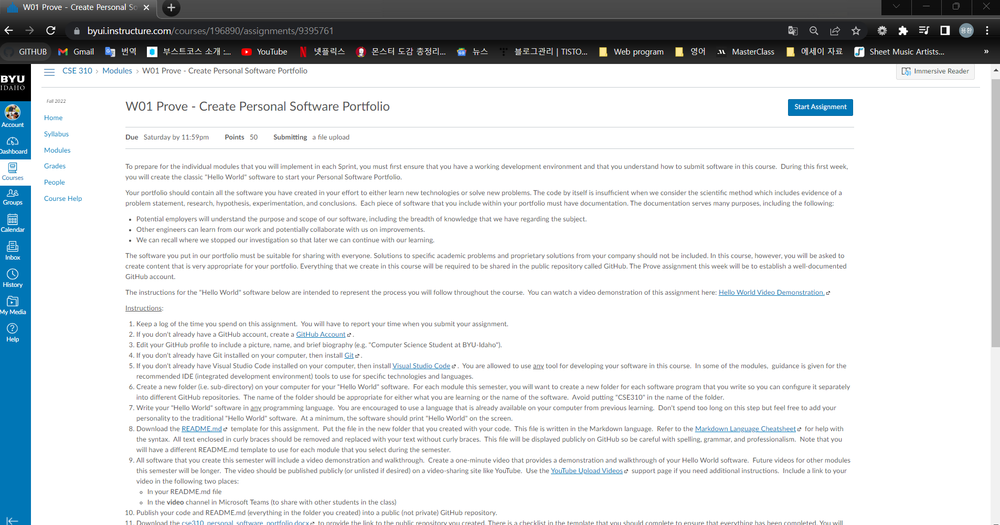

# Overview

This is a hello world project.
The purpose of the project is printing word 'hello world.'

Before starting any other specific programming, I just check whether everything is great or not.

[Youtube for explanation of the project](http://youtube.link.goes.here)

# Development Environment

* Python 3.10.4 64 bit
* Visual Studio Code
* [Git](https://github.com/YongLeeCode/helloworld)

# Useful Websites

{Make a list of websites that you found helpful in this project}
* [Markdown cheat sheet](https://www.markdownguide.org/cheat-sheet/)
* [W01 Prove Create Software Portfolio](https://byui.instructure.com/courses/196890/assignments/9395761)

